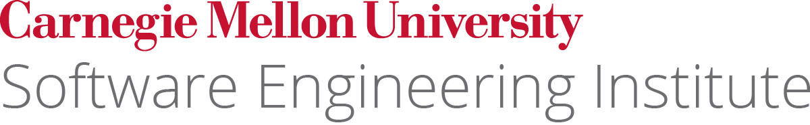

# Foundry Appliance {version}

Welcome to the **Foundry Appliance**. This virtual machine hosts workforce development apps from the [Software Engineering Institute](https://sei.cmu.edu) at [Carnegie Mellon University](https://cmu.edu).

## Getting started

The appliance advertises the _foundry.local_ domain via mDNS. All apps are served as subdirectories under this domain.

To get started using the virtual appliance:

1. Download [root-ca.crt](root-ca.crt) and trust it in your keychain/certificate store. This removes browser certificate warnings.
2. Navigate to any of the apps in the following two sections.
3. Unless otherwise noted, the default credentials are:  

    |key|value|
    |-|-|
    |username|`administrator@foundry.local`|
    |password|`foundry`|
    |code|`123456`|


## Foundry apps

The following Foundry applications are loaded on this appliance:

| location | api | description |
| -------- | --- | ----------- |
| [/identity](/identity)|[api](/identity/api)| _Identity_ manages logins/credentials across all of the apps. It can integrate with any OAuth2/OIDC application.|
| [/topomojo](/topomojo)|[api](/topomojo/api)| _TopoMojo_ allows users to build on-demand labs.|
| [/gameboard](/gameboard)|[api](/gameboard/api)| _Gameboard_ provides a platform for cyber competition development and delivery.|

## Third-party apps

The following third-party applications are loaded on this appliance:

| location | description |
| -------- | ----------- |
| [/gitea](/gitea)| _Gitea_ provides a user interface for editing the web content on the appliance (including this page).|
| [/pgadmin](/pgadmin)| _pgAdmin_ provides a GUI for managing the PostgreSQL databases for each app. |

## Demo challenge

The appliance comes preloaded with a sample challenge from _President's Cup 2020_. Run the following commands to download the virtual machine images (~20 GB) to ESXi and load the challenge into TopoMojo.

```
cd ~/foundry/content
./content-import pc2-d01.json
```

## Under the hood

For command line access to the appliance:

```
ssh foundry@foundry.local
```

The SSH password is `foundry`. Then you can run normal Kubernetes commands via `kubectl`.

```
kubectl get pods
```

The code for building this virtual machine is [available on GitHub](https://github.com/cmu-sei/gameboard-appliance)

The appliance runs all of the apps in a single-host Kubernetes cluster provided by [K3s](https://k3s.io/). This provides a starting point for production-ready deployments in a datacenter or cloud.

{: style="width:400px;margin:40px 0px 0px"}
