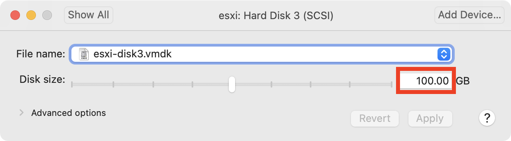

# TopoMojo

## TopoMojo apps

The following Foundry applications are loaded on this appliance:

| location                 | api                   | description                                                                     |
| ------------------------ | --------------------- | ------------------------------------------------------------------------------- |
| [/topomojo](/topomojo)   | [api](/topomojo/api)  | _TopoMojo_ allows users to build on-demand labs.                                |
| [/gameboard](/gameboard) | [api](/gameboard/api) | _Gameboard_ provides a platform for cyber competition development and delivery. |

## Demo challenge

The appliance comes preloaded with a sample challenge from _President's Cup 2020_. Run the following commands to download the virtual machine images (~20 GB) to ESXi and load the challenge into TopoMojo.

```
cd ~/foundry/topomojo
./import-content content/pc2-d01.json
```

## Connecting VMware ESXi

TopoMojo requires a VMware ESXi hypervisor to deploy lab virtual machines. For testing, the easiest way to install ESXi is with William Lam's [ESXi virtual appliance](https://vmwa.re/nestedesxi).

Here's how to deploy ESXi as a virtual machine:

1.  Download the latest ESXi virtual appliance OVA from [https://vmwa.re/nestedesxi](https://vmwa.re/nestedesxi)
2.  Deploy the OVA using [VMware Workstation or Fusion](https://www.vmware.com/products/desktop-hypervisor.html). You can change deployment variables like the root password, but the default password is `VMware1!`.
3.  Immediately **power off** the ESXi appliance after it starts booting. This gives you an opportunity to change a few options before the boot scripts run:

    - Expand the size of _Hard Disk 3_ to something that can hold a few virtual machines. **100 GB** is a good amount if you have enough free space. This storage will be thin provisioned, so the VM will only use it if needed.

      

    - Add the following lines to the bottom of `~/Virtual Machines/appliance-name/appliance-name.vmx`:

            guestinfo.ssh = "TRUE"
            guestinfo.createvmfs = "TRUE"

      This will enable the ESXi SSH daemon and create a new VMFS datastore from the largest disk in the appliance.

4.  Boot the ESXi appliance and note the IP address it receives (via DHCP by default).
5.  On the Foundry Appliance run `~/foundry/setup-esxi <esxi IP address>` to configure ESXi appropriately. The script configures **esxi.foundry.local** to point to the ESXi server, installs a certificate for the same hostname, and mounts an NFS datastore from the Foundry Appliance.

{: style="width:400px;margin:40px 0px 0px"}
